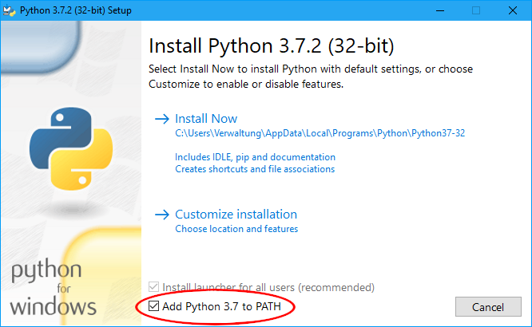

Documentation
=============

The Documentation you are currently reading is written using [mkdocs](https://www.mkdocs.org/). It is a tool that will generate a static website based on files writting in [markdown](https://www.markdownguide.org/). Markdown has the advantage that it is simple to read and write, and that there are several tools that can translate a markdown file into languages like html or latex.

# Installation

Mkdos is written in [python](https://www.python.org/) and is distributed through the python internal package manager [pip](https://pypi.org/project/pip/), thus you need to get python and pip running on your operating system first.

## Windows

1. Download the latest [Python3](https://www.python.org/downloads/windows/).
2. When running the setup program make sure to check `Add Python 3.x to PATH`.

3. Install python
4. Open powershell or cmd, and type: `pip3 install mkdocs`.

## MacOS

MacOS already comes with Python already installed, however pip is still missing. The easyest, and most nondistructive way is to install the MacOS package manager [homebrew](https://brew.sh/index_de) first. The advantage of homebrew are that it will only modify your home directory, but not the root dir. So your OS will not be touched by this.

1. Install [homebrew](https://brew.sh/index_de)
2. Install Python from homebrew, which will also install pip. 
3. Run this command: `brew install python`
4. Install mkdocs: `pip3 install mkdocs`

Alternativeley, without Homebrew, you can use the depreceated but preinstalled `easy_install` tool to install pip: 

1. Run `sudo easy_install pip` to install pip
2. Update pip with `sudo pip install --upgrade pip`
3. Run `sudo pip install mkdocs` to install mkdocs

## Linux/*BSD

Also Linux/*BSD comes pre installed with python. Most distributions also deliver pip by default. If its not installed you may need to figure out how to install pip3 through the package manager of your system.

1. Install pip3 with these commands according to distributions: 
    - __Ubuntu/Mint__: `apt install python3-pip`
    - __Fedora/CentOS__: `sudo dnf install python3-pip`
    - __Arch/Manjaro__: `sudo pacman -S python-pip`
    - __openSuse__: `sudo zypper install python-pip`
    - __*BSD__: You are already advanced enough to know how you can force the bits on your disk to become pip by meditating upon it.
2. Run `pip3 install mkdocs` to install mkdocs only for the current user,
or run `sudo pip3 install mkdocs` to install mkdocs systemwide. Last one has the higher chance to work properly.

## Android/ChromeOS
This might sound funny, but according to the growing amount of Android tablets with keyboard, and ChromeBooks this might actually be useful.

1. Install the [Tremux App](https://termux.com/) from [f-droid](https://f-droid.org/packages/com.termux/).
2. Launch Termux and type `apt update`
3. Install python and git with the command: `apt install git python`
4. Now install mkdocs with `pip install mkdocs`.

From here on everything will be the same as on Desktop. If you want to edit the files you can (besides vim or emacs which are available through Termux) use your favourite text editor on android. This is possible by opening the files with the Termux integration of the build in android file manager:

## Update
Sometimes mkdocs changes the way how to serve, or the syntax will differ. This is why you should make sure to always run the latest version of mkdocs. To ensure this simply run `pip3 install --upgrade mkdocs` or `sudo pip3 install --upgrade mkdocs` if you installed pip system wide on a linux/bsd system.

# Using mkdocs
In order to extend this documentation you have to clone it from its [git repository](https://github.com/fsin-ohm/matomat-documentation). When you cloned it, you will find a [mkdocs.yml](https://github.com/FSIN-ohm/Matomat-Documentation/blob/master/mkdocs.yml) file, and a [docs](https://github.com/FSIN-ohm/Matomat-Documentation/tree/master/docs) directory inside. The yaml file is the [config file](https://www.mkdocs.org/user-guide/configuration/) while in the directory docs the documentation files are stored. [here](https://www.mkdocs.org/user-guide/writing-your-docs/) is a guide about how to use mkdocs.

## Write and Deploy
If you are writing a documentation page, and want a live preview of it you can enter the root directory of this documentation project, and then run `mkdocs serve` this will start the mkdocs internal webserver on port `8000`. So all you have to do is type `localhost:8000` into the addressbar of your browser, and here you go. If you modify a file, and save it, mkdocs will reload the page and show you the new content.

If you want to deploy the page, so it will be up to date at the [github pages](https://fsin-ohm.github.io/Matomat-Documentation/) simply type `mkdocs gh-deploy`. However please be aware that this will not push your changes to the `master` branch of the repository. So you still have to commit and push your changes to the actual git repository of this documentation.

