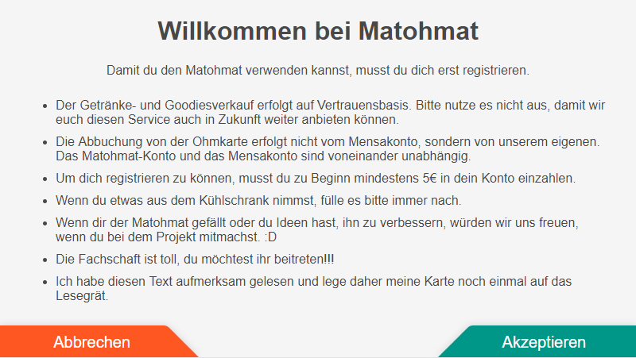

# MatΩhmat documentation

MatΩhmat is a cash system designed to cell Mate, sweets and other joyful goods :D.
MatΩhmat is created by and for the [students of the IT-Fculty](https://fachschaft.in.th-nuernberg.de/) of
the [TH Nuermberg](https://th-nuernberg.de) University. 
It is the successor of the [k4cg](https://k4cg.org) [Matomat](https://github.com/k4cg/matomat) and
the [Fablabl NBG](https://fablab-nuernberg.de/) [Matomat](https://matom.at/).

MatΩhmat allows users to register and have an account where they can pay money to. From this account they can then
buy what is Provided by the [Fachschaft](https://fachschaft.in.th-nuernberg.de/).

The design of the system is modern, open, and mostly designed with technologies that IT students of
[TH Nuermberg](https://th-nuernberg.de) are able to understand. This should enable future generations of students
to administrate, and extend the system with cool features.

MatΩhmat consists of three major parts, 

 - a Server using MySQL to store all Persistent information, and handle Background Jobs.
 - a web based Admin frontend with which is possible to administrate the system.
 - a frontend based on a Raspbery PI which handles the interaction with the users.

### The Server
The core is the Server with which all other parts of MatΩhmat communicate with through a [REST-API](https://en.wikipedia.org/wiki/Representational_state_transfer)
 based on the [JSON](https://de.wikipedia.org/wiki/JavaScript_Object_Notation) protocol.
The Server is written in java using the [Spring Framework](https://spring.io/) for providing the REST-API, and
[Hibernate](http://hibernate.org/orm/documentation/5.3/) to communicate with the [MySQL](https://www.mysql.com/de/) database.

### The Admin-Fronted
The Admin-Frontend is written HTML, CSS, and [TypeScript](https://www.typescriptlang.org/) using the [Angular](https://angular.io/)
framework. It is a web application that can be delivered by a static web sever like [Nginx](https://www.nginx.com/resources/wiki/).
All the the persistent data it need it gets form the [MatΩhmat Server](#the_server).

### The User-Frontend
The User-Frontend is a little wooden box containing a touch display, a RaspberryPI, and a RFID scanner. It displays a
touch friendly webpage hosted on the device itself. The page comunicates directly with the [MatΩhmat Server](#the_server)
through its REST-API. It is created using pure HTML5, CSS and JavaScript.

#### Manual of the User-Frontend

##### Manual for Users

To start with the order the user needs a card which cannot generate different numbers when scanning it on the RFID scanner. We recommend the Ohm-Card of the Hochschule for the students. On the touchdisplay of the little wooden box the user will see that he needs to set his Ohm-Card on the RFID scanner. After doing that the Web-Client sents a request to the server if the number of the Ohm-Card is already in the database. If not the user will forwarded to the register-page where he needs to register himself first.

As you can see above you need to accept the terms how to use the MatΩhmat. If you agree with them you have to set your Ohm-Card on the RFID scanner again to register yourself as a user in the database. After that you will forwarded to the credit-recharge-page where you have to recharge at least 5€ (which is also written in the terms of the register-page) to be able to start ordering goods from the MatΩhmat. Otherwise you will forwarded to an error-page because you're not allowed to recharge your account at the beginning of the registration with less than 5€. If you do so the registration of your account in the database will be failed and you have to register yourself again until you recharge at least 5€.

As you can see above on the credit-recharge-page there is a picture of Dagobert Duck (eng: Scrooge McDuck). This will say if you want to recharge your account with money you need to pay in money in this savings box which is in the Fachschaft. On the right side of Dagobert there is something like a numberpad. There you have the possibility to select manually how much money you want to recharge your account with credit. If you have selected a wrong number you can click on the arrow symbol which can be found on the right side above of the numberpad. If you want to delete the whole input you can click on the button "C" on the left of the arrow symbol to delete it.
Another possibility to select the amount of money to recharge your account with credit is on the left side of Dagobert. For example you want to recharge your account with 15€. Then you can click on the left side on the button "+10€" and after that on the button "+5€". So you see the buttons on the left side will add the amount of money quickly and you can see your input on the numberpad on the right side of Dagobert.
If you are satisfied with your input you can click on the button "OK" underneath the numberpad. If you have changed your mind and do not want to recharge your account with credit you can cancel the whole process to recharge your account with money with the button "X". Then you will forwarded to the main-page.

After recharging your account with credit you will forwarded to the main page where you can see all products from the Fachschaft IN which are currently offered. Above the main-page you can see a bar with the credits your account have on the left side. In the middle is the amount of money for all products you have selected for the current session you need to pay for and on the right side you can click on the button "Aufladen +" to go the the credit-recharge-page for recharging your account with money.

On the middle of the main-page you can see the list of products you can select for your order. So if you want a product you need to click on it. You can check your amount of the selected products right above of it. The productlist can be huge so if you cannot find the product in the list but it is in the Fachschaft IN you should scroll the productlist to the left or right first.
As you can see on the picture above there were selected the products "Club Mate" two times, "Twix" three times and "Snickers" one time. To sum up the three products we have an amount of 2,40€. This amount of money you can find it on the middle of the main-page above. If you are overthinking your choice of products or the amount of them you can simply minus one of the amount of the product by clicking on the garbadge container underneath the product. This will also change the amount of money on the notch in the middle of the main-page above.

If you do not want to buy any products at all you can cancel with the button "Abbrechen" and this will lead you to the first page where you need to scan your Ohm-Card. This means the system logged you out. But if you do want to buy and after choosing all products you want for your order you now need to click on the button "Kaufen" to finish your the process. After that the thank-you-page will show up with a random generated GIF from the GIPHY-server which you can see underneath.

After a few seconds the thank-you-page will forwarded you to the first page with the RFID-scanner and the whole session is cleared.

##### Manual for System-Admins

Using the User-Frontend as a Point-Of-Sale-System you need a Raspberry PI and a server. First you need to understand how to set the MatΩhmat-Server up and know the structure of the REST API to start with the MatΩhmat-Frontend. The webpage will hosted on the Raspberry PI itself. Then you need to clone the folder of the [MatΩhmat-Frontend](https://github.com/FSIN-ohm/Matomat-Frontend) on github to install the User-Frontend on you computer. There is a file in folder named "config.js" to set the servername up for the MatΩhmat-Frontend and take several configuration. 

As you can see in this picture above just replace your servername in the string of the variable "server". To see the webpage we recommend a touchdisplay for the Raspberry PI. 

Through requests in the MatΩhmat-Frontend you can get the products through the REST API from the server to see the productlist on the webpage. If you want to change products or add more to the productlist you need to do this in the MatΩhmat-Admin-Frontend. To understand how to install the MatΩhmat-Admin-Frontend on your system just go to this link: [MatΩhmat-Admin-Frontend](#Admin_Frontend).

##### Manual for Admins and Developers

To start developing the User-Frontend you need to go on this github-link: [MatΩhmat-Frontend](https://github.com/FSIN-ohm/Matomat-Frontend) to clone the folder on your desktop. In this folder there is a file named config.js where you can take several configuration for the use of the User-Frontend like where the server is hosted or the session timeouts.

As you have done all these configurations in this file there is another file named script.js where you can do bugfixes if you find some or you can develop more features for the User-Frontend. The functionalities of the User-Frontend will be described in the further sections.

First of all it is important to know the structure of the User-Frontend. This is why we start with the pages we have in it. You can see this underneath in the picture.

As you can see in this picture above we have seven pages in the function window.onload in the User-Frontend. The startPage where you put your Ohm-Card on the RFID-scanner, then the mainPage where you can see the productlist for the order you choose to buy and the bar on the mainPage above with your credits, the amount of money for your order and where the button for leading you to the addMoneyPage where you can recharge your credits with money and if you need to register yourself first we have the registrationPage, too. After the order you will forwarded to the thankYouPage. Between these pages we have a loadingScreen with the hamster-gif you see for a short time if you will forwarded to another page on the webpage of the User-Frontend. If there is any error in a function or in the pages we have an errorScreen because on the Raspberry PI it is just important for the user that there is an error or not and if so he just needs to contact the person responsible for the User-Frontend for resolving the problem for this errorScreen.

In the function window.onload there are also several functions like to hide every other pages which are not the current page where the user just needs to see. That means if the user is on the mainPage then all other pages will be hided from the user.

...