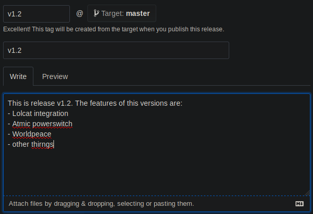
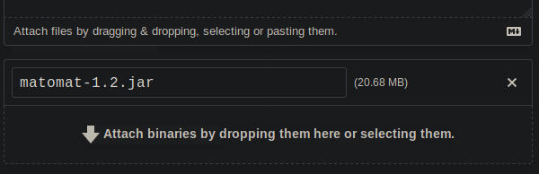
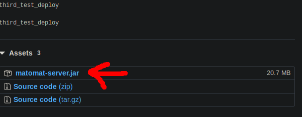

Server
======

# Introduction

The matohmat server is a REST Api server written in Java8 and [spring](https://spring.io/). For the persistence it uses a [MySQL 8](https://dev.mysql.com/doc/relnotes/mysql/8.0/en/) database. For hosting it it is highly suggested to use [Docker](https://www.Docker.com/) as there is already a Docker compose setup available. Read more about the setup [here](#setup). The server is only supposed to provide the bare api.

# Setup

For seting up the Matohmat server it is hightly suggested to use [Docker](https://www.Docker.com). It is possible to run it without, however you may have to configure a bit more in order to get it ruing without Docker. This or that way you may have to have experience in Docker in order to be able to read and understand the Docker config.

The Docker repository for the server can be found at the [matohmat-docker](https://github.com/FSIN-ohm/matohmat-Docker). The repo makes use of Docker and [docker-compose](https://docs.Docker.com/compose/). Before seting up the server make sure you understand both tools.

**What you need to know to setup a matohmat server**
- Basic understanding of **GIT**
- Good understanding of **docker**
- Good understanding of **nginx** and reverse proxy
- Basic understanding of **SQL**

#### Seting up the server via docker
1. Make sure [Docker](https://docs.docker.com/install/) and [docker-compose](https://docs.docker.com/compose/install/) and [git](https://git-scm.com/) are installed on your system. These tools are both available for the moust major operation systems, including Linux, Windows and Mac.
2. Clone the matohmat-docker repository: `git clone https://github.com/FSIN-ohm/matohmat-docker.git`
3. Enter the matohmat-docker directory: `cd matohmat-docker`
4. Build the docker container by running: `docker-compose build`. This will take some while as many commands are run in order to build the image for the matohmat server.
5. When the build is done you can already test run the server with
   - `docker-compose up` for running in forground
   - `docker-compose up -d` for running the server in daemonized mode.
6. !!CAUTION!! When you start the server for the first time the matohmat container might start faster then the database because database is not initialized yet. This will lead to a crash. If this happens simply wait for a bit and the restart the docker container: `docker-compose stop` then `docker-compose up`.
7. In order to make your installation be ready for production you will want to [configure it](#configuration)

### Update via docker
For Updating an already existing installation you will want to do these things
1. **BACKUP your installation directory.** Do an **offsite backup** at best.
2. Enter your docker installation directory
3. Shutdown the current installation: `docker-compose down`
4. Get the current docker configuration with `git update`
5. Build the update: `docker-compose build`
6. Start the new server again: `docker-compose up`

If something fails do a rollback, and if you can't get the update running [contact the developers](https://github.com/FSIN-ohm/matohmat-docker/issues/new).

### Configuration via Docker

Within the `matohmat-docker` directory you will find the `docker-compose.yml` file. *(Please make sure you understand [docker-compose version 2.1](https://docs.docker.com/compose/compose-file/compose-file-v2/))*

#### The Database Server Container
In the `db` server you will find the `volumes` entry  
- `./data:/var/lib/mysql`  
This is pointing to the `data` directory. So here the database is saved. More about this [here](#docker_storage).

#### The Server Container 
**Ports:**  
by default the matohmat server is mapped to `127.0.0.1:8080`. You may want to change this line if you want to make the server run under another port. However be aware if you remove the `127.0.0.1` ip address the port will be exposed to the network, **even if you are running a firewall, as docker might manipulate the iptables!**

**Environment:**

Here the Environment variables are listed that will be passed into the server docker container. Here is what they mean.

- `PARAM`: Parameters that will be passed to the matohmat server binary. Se the server [commandline parameter secion](#commandline_parameters) for more details
- `CONFIG_FILE`: This is the relative path to the server configurationfile within the container. If you change this, you also need to change
the location to where the config file is mapped to from
the host to the container.

**Volumes**

Two files are being mapped __read only__ from the host to the host filesystem to the container filesystem.
These are
- __`device_keys.txt`__
- __`server.conf`__
- __`mail_template.txt`__

If you change their location outside and inside the container make sure the configuration where to find this files is changed as well.

### Docker storage

With in the matohmat-docker directory you will find the directory [data](https://github.com/FSIN-ohm/matohmat-docker/tree/master/data). Here the content of the database is saved.  
**!!!ATTENTION!!!** When backing up the matohmat data it is highly recomended to backup the whole `matohmat-docker` directory, not only the `data` folder.

### Setup without docker

If you want to let the server run directly on you machine without using docker, you many want to download the latest version of the server `*.jar` file as well as the source code `*zip` from
https://github.com/fsin-ohm/matomat-server/releases.  

1. Before running the actual matohmat server you will want to setup the database. For doing this you will find three SQL files in the `Database` directory within the zip file. These files are:
- CreateDatabase.sql
- create_routines.sql
- create_views.sql
Login to your mysql server, and run all of these files in exactly that order. However you must edit the `CreateDatabase.sql` first, and change the password of the `matohmat` user first. Read more about this in the [security section](#security).

2. After you've setup the database, you can configure the server by first taking the default configuration file called `server.conf` from the zip file, and editing it so it will fit your needs. Read about how to configure the server in the [configuration secion](#configuration).  
When the server is configured you can run it by using the command `java -jar matohmat.jar <path_to_the_confgig_file>.conf`. The config file always has to be passed to the server as parameter.

### Configuration

The configuration of the Matohmat Server is done through a configuration file which is passed to the server as parameter. The file is not a `.ini` file even if it looks like it. The separator between key and value is a `=` sign which may not contain a space before or after.

Here is what the single keys mean:
- __`db_host`__: Host name of the database server. You may not need to edit this if you want to run pure docker setup as it is already set to the host name of the database image `db`.
- __`db_schema`__: The schema used for storing the matohmat tables into. You may not change this without editing the sql files inside the `database` directory.
- __`db_user`__: The user which accesses the database. You must not make this the root user! Also before changing the user here you might want edit the sql files inside the `database` direcotry.
  __!!CAUTION!!__ changing the user through the sql file can only be done before setting up the server,
  if you already have meaningfull data in your database you must change the user by hand through sql commands. If you do remember to backup the database.
- __`db_password`__: Password for accsing the database as `DB_USER`. You may not change this without editing the sql files inside the `database` directory.
  __!!CAUTION!!__ changing the password through the sql file can only be done before setting up the server,
  if you already have meaningfull data in your database you must change the password by hand through sql commands. If you do remember to backup the database.
- __`device_keys`__: The file containing the device keys. You must edit this file as leaving the default value in it is considered insecure. Read more about this file at [device keys section](#device_keys).
- __`origin`__: Write down the **urls of the clients** that want to access the api server. If you don't list the URLs of the clients here you will get issues with [`CORS`](https://developer.mozilla.org/en-US/docs/Web/HTTP/CORS) later, and you may not be able to send requests. Seperate the different urs with a `;;`. Use the `null` as a url if you want to connect with a client that you load from a file and not from a server. However remove `null` in production as having `null` in the origin list is considered insecure.
- __`context_path`__: This is the url context path on wich the server is running. That means if the server can be accessed by simply doing http requests against the host name, for example `https://api.exmaple.com` the context path is simply `/`, but if the server should be reached through a sub bath, for example `https://example.com/api` the context patch has to be `/api`. Please be aware that you must not write a tiling slash behind the path!
- __`mail_enabled`__: If set to true the email interface of the server will be activated. Read more about this at the [email interface section](#email_interface)
- __`mail_starttls`__: This will make emails send by the email interface be encrypted by the `STARTTLS` m/api`. Please be aware that you must not write a tiethod.
__!!CAUTION!!__ disabling this is considered insecure.
- __`mail_smtp_host`__: The url of the smtp server from which you want to send the emails from.
- __`mail_smtp_port`__: The port at the `mail_smtp_host` where smtp is running at. If you use `STARTTLS` this port will usually be __587__, if you don't use encryption it will be __25__.
- __`mail_address`__: The mail address that will be used as sender when a mail got send by the email interface.
- __`mail_smtp_user`__: The name of the user at the smtp server.
- __`mail_smtp_password`__: The password of the `mail_smtp_user`.
- __`mail_template_file`__: The relative path to the mail template. Read more about the mail template file over at the [email interface section](#email_interface).
- __`mail_subject`__: This line is the template for the mail subject. Read more about this over at the [email interface section](#email_interface)
- __`check_interval`__: If the email interface is enabled this will contain the period of minutes after which the stock is being checked. Read more about this over at the Read more about this over at the [email interface section](#email_interface)

### Commandline Parameters

- __`--test-mail`__: if the email interface is setup correctly you can send a test email to all registered
matohmat admins by starting the server with this email. The server will quit emedially after.
- __`--help`__: Will give you a rudimentary information about the parameters the server will take.

### Device keys

The file `device_keys.txt` contains a list of keys for clients that shall have the permission to add users. If a client is not listed here it is not able to add users. (Except the admin frontend as admins can always add new users).  
The keys listed in this file also have to be installed in the matohmat client. Please see the documentation about the user client to find out how to install device keys there.

The scheme of the file looks like this: every line contains a name of a key and the key itself. Name and key are separated by a `:`. Like this:  
`<name of the key>:<the key it self in some giberish>`.  
**!!!ATTENTION!!!** There is already a default key. Remove this key and replace it by a custom one. Otherwise your system will be insecure.

# Email Interface

The Email Interface of the server is a service that will send an Email to every active admin if a reorder point was hit. The email interface needs to be configured and enabled using the `.conf` file of the matohmat, and requires to have a connection to a working email service somewhere. __!!CAUTION!!__ it is not suggested to use a private email account for the Email Interface. Please register a new one for the matohmat.  

The email interface can not yet predict how much should be bought once a reorder point has been meet. This function will require heuristic prediction models, which is rather complicated. However the function could be implemented in the future.  
At the current state the email interface can notify about the current stock.

Since for checking the stock a great amount of calculation is required, required stock is only checked in certain intervals. The default value for `check_interval` is 1440 (minutes), which means that stock is checked once a day.

#### Configureing the Email Interface

The Email interface first needs to be configured in the `.conf` file of the server. Please read the [configuration section](#configuration) in order to know how to do that.  

When having set up the email interface you can modify the email template file. This file will be what is send in an email, however it contains variables that will be replaced with the value calculated by the server. Every replacement value begins with `<{` and ends with `}>`. In between the name of the value is written.
The currently available values are:
- __`product`__: The Product that went below the reorder point and triggered the email.
- __`crates_left_list`__: A list of how much is still left of each product.

In addition to the template file there is also a template line for the `Subject` header. This template line is written directly into the `conf` file of the server using the `mail_subject` key.  
This line will also accept the `<{product}>` template value, which has the same meaning as the one used in the email content.

# Security

This section will describe how to secure your matohmat server. Please be aware that you will want to know how to do these steps __BEFORE__ you finally setup the matohmat server.

1. Change the password for the matohmat user in the database.  
   This is required if you setup the server without using docker. Within docker this step is not that crustal, as database and 
   server containers are connected through an internal virtual network, that is not accessible from the host, or outside these
   two containers.  
   However if you do not use docker for your setup you will first want to edit the `CreateDatabase.sql` file first. Here you will find a `CREATE USER` line near the end. Her you can replace the `password_here` default password with your own password.  
   After initializing the database make sure to set the db user password in the server config accordingly.
2. Use Encryption  
   The Matohmat server is not ment to be accessable from the internet directly, as it can only accept HTTP requests,
   however without using __HTTPS__ any security messure will be useless. Therefore you must setup a nginx or an apache web server (or others), to acct as a __reverse proxy__ server that will take care of the encryption.
3. Change the default device key that is listed in your `deviceKey.txt`. This __MUST__ be changed otherwise users which are not       physicals in your fissility can register a new user, which will clutter up your database.
4. Change the Default password of the `root` admin.  
   You can do this once the server is fully set up. Please look into the description of the admin frontend, how to change the
   passwort of the root admin. However if you don't do this everyone who ever saw this source code will have access to your system.
5. Ensure the database is backed up.  
   It is highly suggested to regularily backup your database or if you use docker, the whole matohmat docker folder.
   Do this by using offsite backup, which means you should backup your data (encrypted) to another device/sever in another building place, to ensure the data is not lost even if the matomat server crashes, or the building its in is struck by a nuclear war head. It's suggested to backup once a day.

# Development setup

# Testing

# Releasing

Sadly role out/role out is not done automatically. You will have to build and deploy the server by hand.

This is what you will want to do to publish a new version.

**When something changed at the database**
Copy the `*.sql` file from the [/Database](https://github.com/FSIN-ohm/Matomat-Server/tree/master/Database) directory from the **matohmat-server** repo into the [/Database](https://github.com/FSIN-ohm/matohmat-docker/tree/master/Database) directory of the **matohmat-docker** repo.  
**!!ATTENTION!!** If you ever want to update the database scheme make sure you include an update routine. For already existing databases. 

**When something changes at the server**

1. **Run tests and make sure everything works before releasing.**
2. Edit the file `build.gradle` and update the version number:
   `version x.y`
3. Build the release version of the server:  
   Within the root directory of the Project run: `./gradlew assemble`
4. Enter the direcotry `/build/libs`. Here you will find find a `*.jar` file with the given version number in the name. This is the build server.
5. Create a new release in github:
    - Create a tag with the version number e.g.: `git tag v1.2 -m "v1.2"`
    - Push that tag to github e.g.: `git push origin v1.2`
    - Create a new [release draft](https://github.com/FSIN-ohm/Matomat-Server/releases/new)  
     
6. Attach the build build `*.jar` file to the release
     
7. Hit `Publish Release`
8. Copy the link to the jar file
   
9. Replace [the line](https://github.com/FSIN-ohm/matohmat-docker/blob/2104f9bc36fd3fb1d7094f8053fbbb0c7fd672b9/Server/Dockerfile#L4) in the `Dockerfile` where the old server got downloaded with `wget`.
10. Make the docker setup be compatible with your new server release if necessary. Then push your changes on the matohmat-docker repo to master
11. **Test the matohmat-docker repo**
**!!ATTENTION!!** Always make sure the master branch of the matohmat-docker repository is **stable**.

# Architecture
